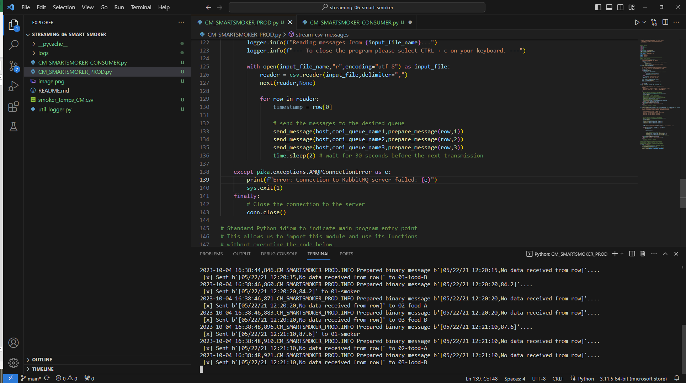
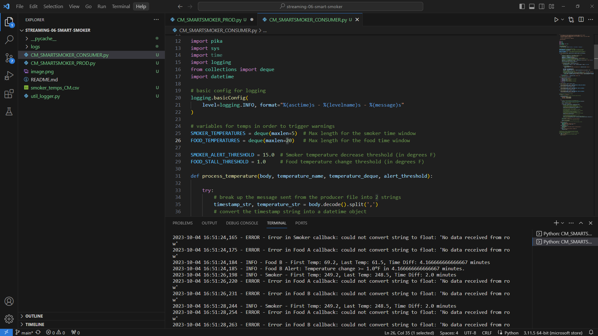

# streaming-06-smart-smoker
CORI MILLER MOD 6 Creating a Consumer

## Project Overview

In previous modules we worked to implement a producer of data.  In this module we will investigate the other end of the pipeline: the consumer.  Here you will see different ways to deal with the sheer amount of data that could be being generated and how informed decisions can be made using different amounts of historical data.

Streaming data may come from web analytics, social media, smart devices, and more. In these two modules, we implement analytics for a "smart smoker" (as in slow cooked food). 

In Module 5, we understood the process, designed our system, and implemented the producer. In this Module 6, we'll add the consumers, implementing analytics based on a rolling window of time, and raise an alert when interesting events are detected. 
Smart Smoker System
Read about the Smart Smoker system here: Smart Smoker
We read one value every half minute. (sleep_secs = 30)
smoker-temps.csv has 4 columns:

[0] Time = Date-time stamp for the sensor reading
[1] Channel1 = Smoker Temp --> send to message queue "01-smoker"
[2] Channe2 = Food A Temp --> send to message queue "02-food-A"
[3] Channe3 = Food B Temp --> send to message queue "02-food-B"
We want know if:

The smoker temperature decreases by more than 15 degrees F in 2.5 minutes (smoker alert!)
Any food temperature changes less than 1 degree F in 10 minutes (food stall!)
Time Windows

Smoker time window is 2.5 minutes
Food time window is 10 minutes
Deque Max Length

At one reading every 1/2 minute, the smoker deque max length is 5 (2.5 min * 1 reading/0.5 min)
At one reading every 1/2 minute, the food deque max length is 20 (10 min * 1 reading/0.5 min) 
Condition To monitor

If smoker temp decreases by 15 F or more in 2.5 min (or 5 readings)  --> smoker alert!
If food temp change in temp is 1 F or less in 10 min (or 20 readings)  --> food stall alert!

## Screenshots

